#Syringe pump build guide

##Step 1. Gather your parts
Print the three parts to the syringe pump (idler, carriage, and motor assembly).  Make sure you have collected all the necessary items from the bill of materials.  Additionally, some tools (needle nose pliers, adjustable wrench, and M3 wrenches) will be helpful.

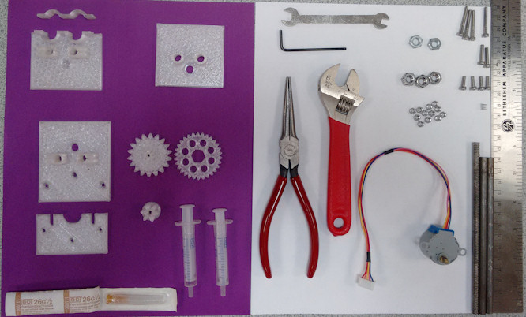

##Step 2. Idler assembly
- We'll start with the hardest part first (unless you have very tiny fingers).  Place an M3 nut in each of the support rod nut traps of the idler.  Sometimes, getting the nut almost positioned and then squeezing it down with the needle nose pliers is helpful; just be careful not to snap off the support rod clamp. 
- The syringe support is connected with a M3x24 bolt.  The spring is optional but I find it helpful when loading/unloading the syringes as it keeps tension on the nut and prevents it from turning.  My 'source' of the spring was an empty retractable ball point pen; I happened to find one with the right diameter (a bit larger than the M3 bolt diameter) and cut it to size.

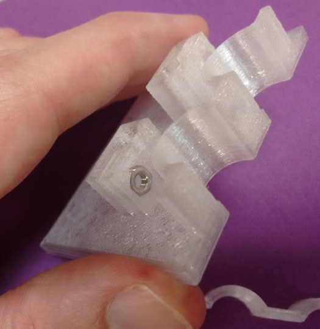

*The idler nut traps are the trickest place to reach*  

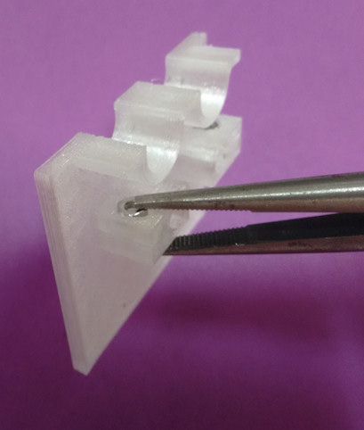 

 *use needle nose pliers to help*  

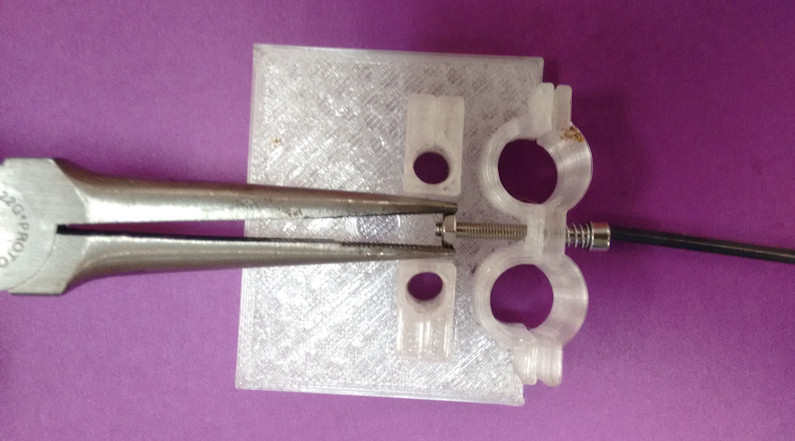  

 *An optional spring makes inserting/removing the syringes easier*   

##Step 3. Support rods
- Slide the support rods into their clamps and push them through until the ends are flush with the idler.  Use M3x10 bolts to clamp the rods tightly.  If you cannot rotate the rods easily, then you have tightened sufficiently.

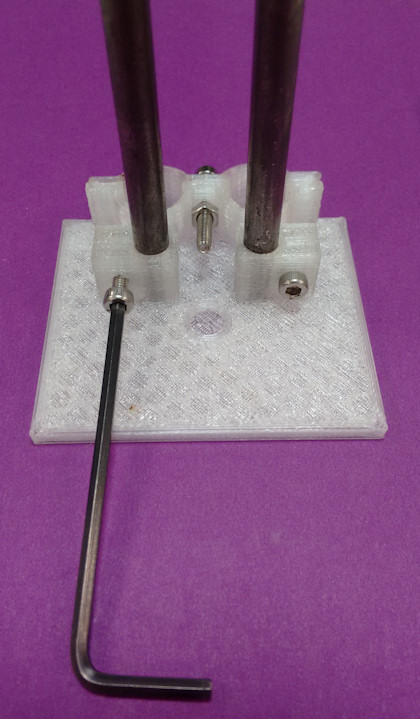

*Some cracking sound while tightening is OK; that's the support material.  Don't overdo it though.*

##Step 4. Threaded rod and carriage
- Slide the carriage on to the support rods with the linear bearings facing away from the idler.  Insert the threaded rod (also known as a lead screw) through the carriage and into its slot in the idler.  
- Thread one nut for the carriage, then an additional nut and a jamnut (the nut that is thinner) onto the lead screw.  None of the nuts need to be tight at this point and all of them should be lower than the height of the support rods.

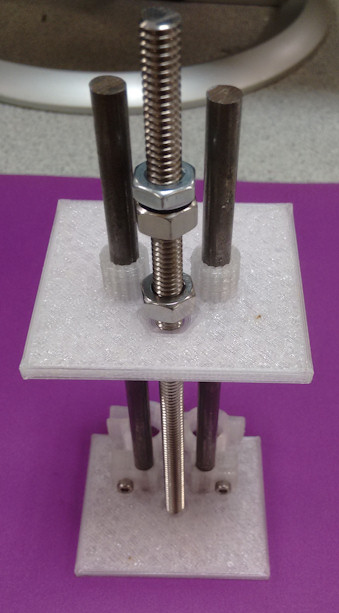

*Hmm, [what is a jam nut](https://en.wikipedia.org/wiki/Jam_nut)?*

##Step 5. Motor Assembly support plate
- Similar to step 3, connect the support rods to the motor assembly support plate.  Tighten the support clamps after you are sure that the syringe pump stands level and the carriage moves smoothly across the support rods.
- If the support rod clamps are sufficiently tightened, then you should not be able to twist the pump while holding the idler in one hand and the motor assembly support plate in the other.

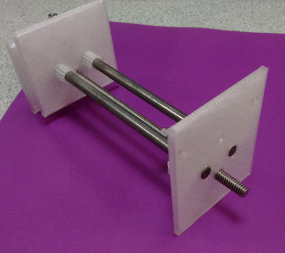

*The support rods should not extend beyond the motor support plate or they will hit one of the gears.*

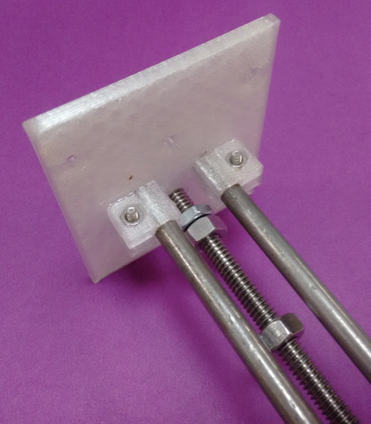

*Make sure the syringe pump sits level on the table before tightening the support rod clamps.*

##Step 6. Adjust jam nut stop
- We now learn what the jam nut is for.  It will prevent the lead screw from "unscrewing" out of our syringe pump.
- Thread the jam nut so that it touches the motor assembly support plate.  Then, turn it about 1/2 turn the opposite direction so it is not tightly against the plate.
- Thread the regular nut so that it contacts the jam nut, taking care not to turn the jam nut and lose the space between it and the plate that you just created.
- Hold the jam nut with the needle nosed pliers and with the adjustable wrench, tighten the nut so that it is "jammed" up against the jam nut.  When you have done this correctly, neither the jam nut nor the normal nut will move on the lead screw

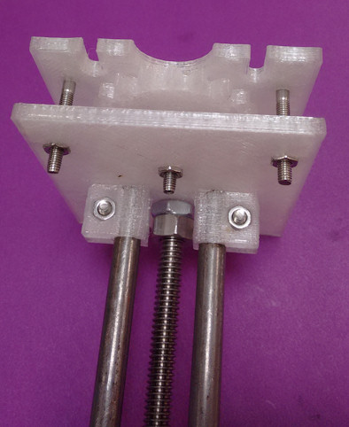

*You want the jam nut as close to the motor assembly support plate as possible without rubbing against it causing unnecessary friction.*

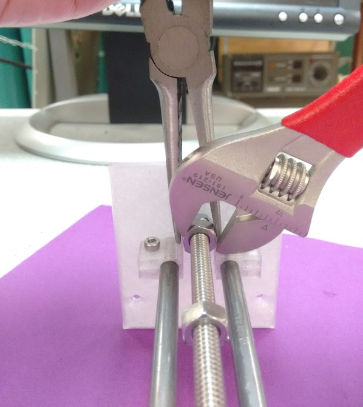

*In the direction of this picture, turn the wrench clockwise and apply a counter-clockwise pressure to the pliers.*

##Step back, admire your work
By "admire" I mean this is a good time to go over the build to ensure that everything is working properly.  The lead screw should turn freely in both directions and it should not come out of the idler support hole.  The support rods should be firmly in place and the pump should stand level on a flat surface.  You should be able to slide the free nut on the lead screw into the nut trap on the carriage.  Then turning the lead screw should move the carriage back and forth. 

##Step 7. Install the driven gear
- Press a regular sized nut into the driven gear.  The gear is thinner than the nut and that is OK.
- Thread a jam nut onto the lead screw just as you did in step 6.  Thread the driven gear onto the lead screw, making sure that the side of the gear that is flush with the nut is pointing away from the motor assembly plate.
- As in step 6, secure the nut holding the driven gear to the jam nut, leaving very little space between the plate and the jam nut.

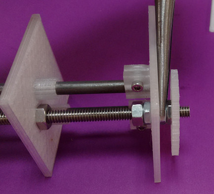

*Use the same procedure as in step 6, but note that you can tighten by twisting the gear instead of using a wrench.*

##Step 8. Install remaining motor assembly
- Install M3 nuts into the nut traps on the motor assembly support plate.  
- Slide the compound gear onto one of the M3x24 bolts.  Make sure that the gear rotates freely on the axis.  It is possible that you may need to strip away a small bit of plastic from the compound gear bore.  This can be done by inserting a screw into the bore part way, then hammering the screw through.  Do this from both sides of the compound gear. 
- Use  3 M3x24 bolts (including the one with the compound gear on it) to attach the back plate to the motor assembly.  Be careful not to over-tighten these screws.  The compound gear should sit between the driven gear and the backplate and should be perpendicular to the table.

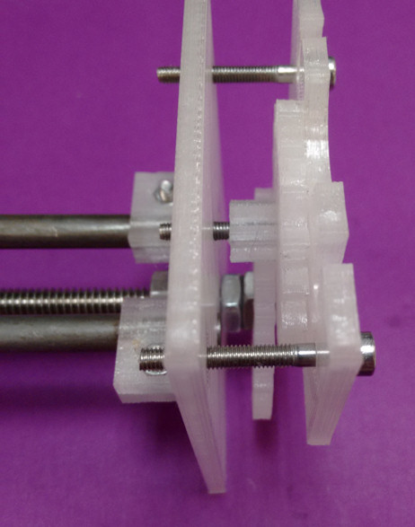

*Better to have the M3x24 bolts too loose than too tight.  You can always tighten them if the gears slip.*

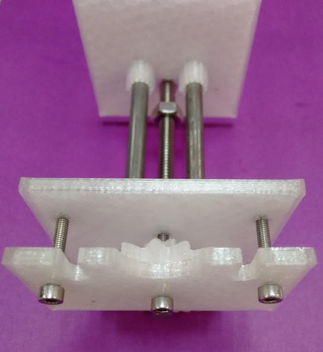

*Try spinning the gears to ensure smooth operation.  Once the motor is attached, the gears won't spin as easily.*

##Step 9. Attach motor gear
- Attach the motor gear to the stepper motor.  It is possible that this is a very tight fit.  You can use a sharp blade to cut away some of the plastic if necessary.
- Attach M3x20 bolts with four nuts as shown in the picture.  Nothing should be tightened at this point.

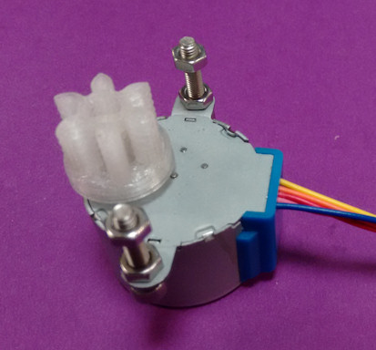

*Note that the motor gear bore is slotted so that it will only attach to the motor one way.*

##Step 10. Mount the motor.
- The back plate should slide in between the two nuts.  Use these to secure the motor in place.  Proper alignment of the motor is with the bolts settled into the bottom of the cutout.
 
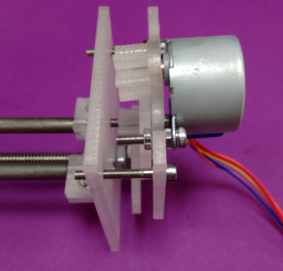

*Using an M3 wrench on the M3 nut will help secure everything in place*

##Build complete
You now have a completed syringe pump and are ready to go on to the next step - setting up the control hardware and communication software.

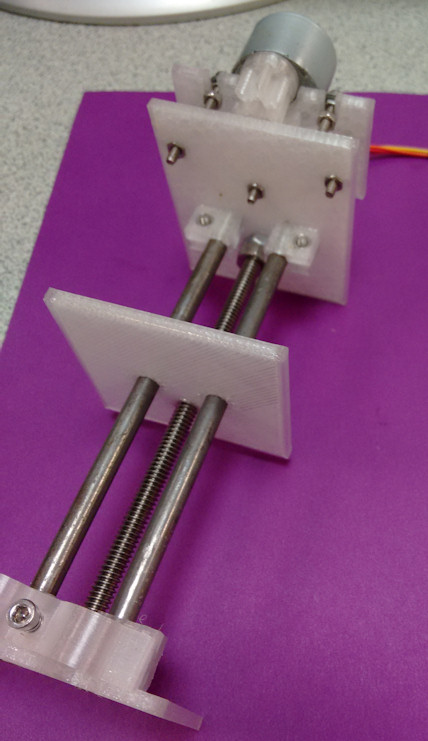

*Nice job!*
